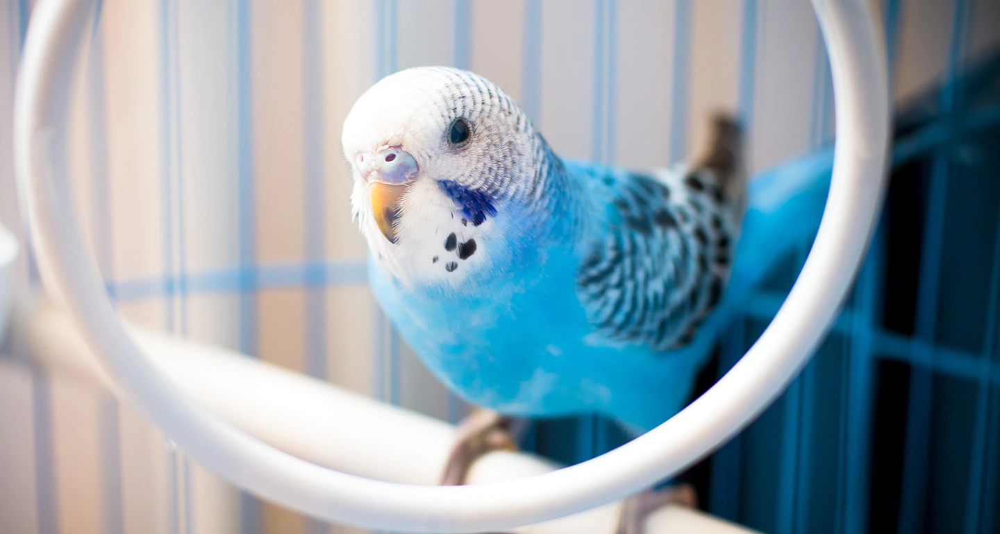
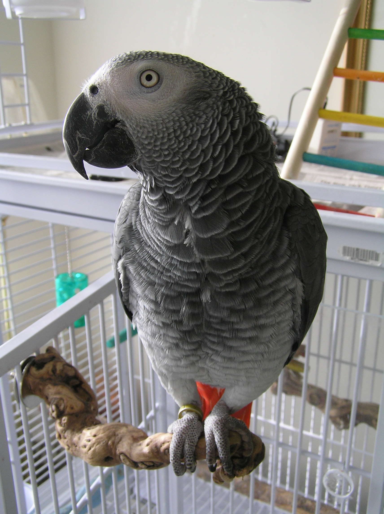
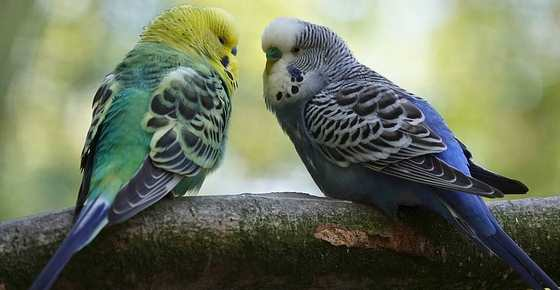

<!DOCTYPE html>
<html>
  <head>
    <meta charset="utf-8">
    <title>BIrdLIfe</title>
    <!--font-family-->
    <link href="https://fonts.googleapis.com/css2?family=Montserrat:wght@100;400;900&family=Ubuntu&display=swap" rel="stylesheet">
    <!--Bootstrap-->
    <link href="https://cdn.jsdelivr.net/npm/bootstrap@5.0.2/dist/css/bootstrap.min.css" rel="stylesheet" integrity="sha384-EVSTQN3/azprG1Anm3QDgpJLIm9Nao0Yz1ztcQTwFspd3yD65VohhpuuCOmLASjC" crossorigin="anonymous">
    <!--External Css-->
    <link rel="stylesheet" href="style.css">
    <!--Font design for logo type-->
    

  </head>
  <body>
        <section class="title-page">
          

            <nav class="navbar navbar-expand-lg navbar-dark">
              <a class="navbar-brand">BIrdLife</a>

              <button class="navbar-toggler" type="button" data-bs-toggle="collapse" data-bs-target="#navbarTogglerDemo01" aria-controls="navbarTogglerDemo01" aria-expanded="false" aria-label="Toggle navigation">
                
              </button>
              

                <ul class="navbar-nav">
                  <li class="nav-item">
                    <a class="nav-link">HOME</a>
                    </li>
                    <li class="nav-item">
                      <a class="nav-link">ABOUT US</a>
                      </li>
                      <li class="nav-item">
                        <a class="nav-link">BLOGS</a>
                        </li>
                        <li class="nav-item">
                          <a class="nav-link">SUPPORT US</a>
                          </li>
                  </ul>
                  <ul class="navbar-nav ms-auto">
                    

                      <li class="nav-item">
                        <a class="nav-link" href="">JOIN US</a>
                        </li>
                      

                    </ul>
                

            </nav>
            

              <h1>EVERY LIFE IS PRECIOUS</h1>
              

                HELP US TO STOP THE ILLEGAL TRADES OF THE BIRD OR WANT A PET FOR YOU
                

                <button type="button" class="title-btn btn btn-lg btn-outline-dark" name="button">DONATE</button>
                <button type="button" class="title-btn btn btn-lg btn-dark" name="button">  SHOP  </button>
              

            

          </section>

          <!----------------ABOUT US------------>
          <section class="about-us">
            

              <h1>ABOUT US</h1>
              

                  We are a community of 1500 members from all over the country who has come with the same motive to save the birds who are getting illegally trade.
                  And also helping them to help the homes to lve comfortably. We are also connected with various birds park.
                

              

          </section>
          <!--SHOP -->
          <section class="bird-buy">

            

              

                

                  
                  <h1>BUDGIE</h1>
                  

                    Blue in color
                    

                    

                      Can talk to their owners
                      

                  <button class="btn btn-lg btn-warning">BUY</button>
                  

                

                  
                  <h1>BUDGIE</h1>
                  

                    Blue in color
                    

                    

                      Can talk to their owners
                      

                  <button class="btn btn-lg btn-warning">BUY</button>
                  

                  

                    
                    <h1>BUDGIE</h1>
                    

                      Blue in color
                      

                      

                        Can talk to their owners
                        

                    <button class="btn btn-lg btn-warning">BUY</button>
                    

                    <button class="carousel-control-prev" type="button" data-bs-target="#slidetarget" data-bs-slide="prev">
                      

                    </button>
                    <button class="carousel-control-next" type="button" data-bs-target="#slidetarget" data-bs-slide="next">
                      
                    </button>
            

          </section>
            
          <!---END-->
          <!--BLOGS-->

<!--Blogs ends-->

<!---SUPPORT Us---->
<section class="support">
  

    <h1>ONE STEP CAN CHANGE THE WORLD</h1>
    

      BECOME THE PART OF OUR BEAUTIFUL WORLD
      

      <button type="button" name="button" class="btn btn-lg btn-outline-light">SUPPORT US</button>
    

</section>
<section>

  <!--donate shop submit-->

  <section class="pricing">

    <h2 class="pricing-text">YOUR SMALL HELP CAN LEAD A CHANGE</h2>
    
DONATE ,SHOP OR SUBMIT YOUR CREATIVE BLOGS

        

        

          

            

              <h3>DONATE</h3>

            

            

              

              HELP US TO SAVE THE BIRDS
               A SMALL HELP IS WORTH MILLIONS
              

            

            

              <button class="btn btn-lg btn-outline-dark" type="button">Sign Up</button>
            

          

        

        

          

            

              <h3>SHOP</h3>
              <h2 class="pricing-text"></h2>
            

            

              
Unlimited Matches

              
Unlimited Messages

              
Unlimited App Usage

            

            

              <button class="btn btn-lg btn-dark" type="button">Sign Up</button>
            

          

        

        

          

            

              <h3>SUBMIT</h3>
              <h2 class="pricing-text">FOR BLOGS</h2>
            

            

              
GOOD BLOGS  WILL BE POTED ON OUR MAGAZINES

              
GET A CHANCE TO WIN AWESOME PRIZES

              GET THE CHANCE TO VISIT  
            

            

              <button class="btn btn-lg btn-dark" type="button">Sign Up</button>
            

          

        

      

  </section>

  <!--Contest-->
  

  <h1>CAPTURE THE LIFE</h1>
  

    We hold monthly contest. Submit your artistery and we will post your pictures on our monthly magazines.
    Get ready!
    

  <button class="btn btn-lg btn-primary" type="button">CLICK TO KNOW MORE</button>
  

</section>
<!--Want to know more-->
<section>
  

    <h1>WANT TO KNOW MORE</h1>
    

      REGISTER YOUR EMAIL HERE
      

      <input type="text" placeholder="ENTER YOUR EMAIL">
  

</section>
<footer class="footer">
  

    

      <i class="fab fa-twitter"></i>
      <i class="fab fa-facebook"></i>
      <i class="fab fa-instagram"></i>
      <i class="fas fa-envelope"></i>
    

    

      

        NEWS
        

        

          JOBS
        

        

          MAGAZINES
          

    

    

      <h3>MAGAZINES</h3>
      <h3>CONTRACTS</h3>
      <H3>TERMS AND CONDITIONS</H3>
    

  

</footer>
  </body>
</html
